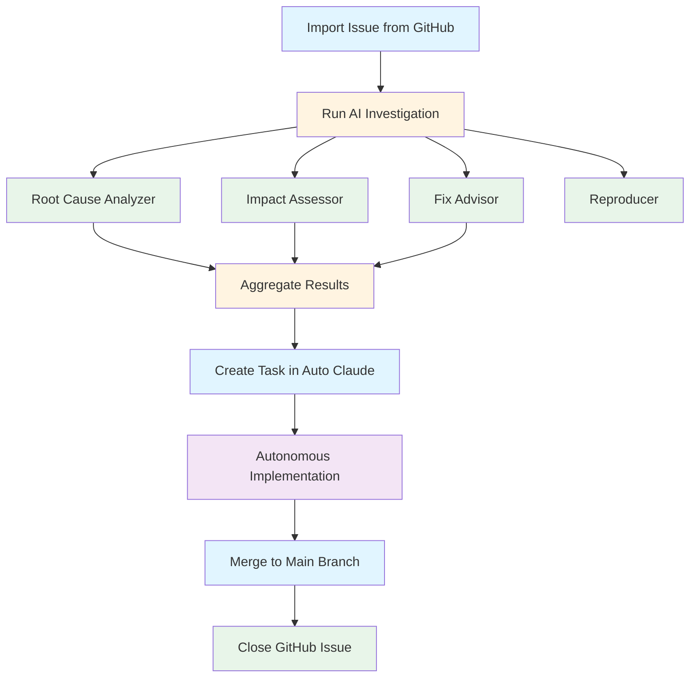
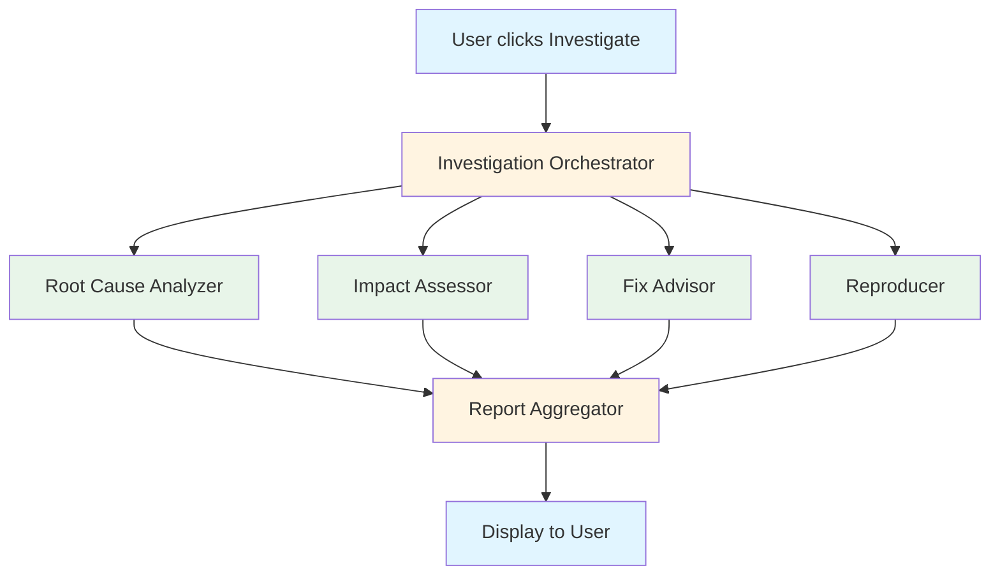
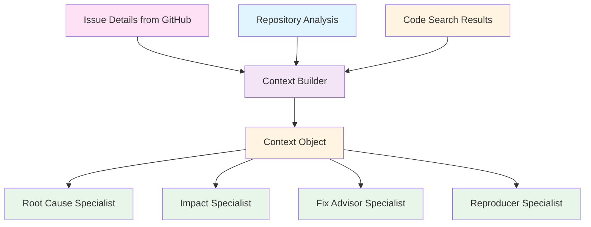

# GitHub Issues Documentation Implementation Plan

> **For Claude:** REQUIRED SUB-SKILL: Use superpowers:executing-plans to implement this plan task-by-task.

**Goal:** Create comprehensive, three-tier documentation for Auto Claude's GitHub Issues integration covering end users, technical users, and pro developers.

**Architecture:**
- Create `guides/github-issues/` directory with three progressive documents
- Document 1 (User Guide): Non-technical, feature-focused, quick start
- Document 2 (Advanced AI Config): Technical, Opus 4.6, pricing, tuning
- Document 3 (Customization Guide): Developer-level, prompts, context, extension
- README.md index for navigation

**Tech Stack:** Markdown (GitHub Flavored), Mermaid diagrams, screenshots (captured from running app)

---

## Task 1: Create Directory Structure

**Files:**
- Create: `guides/github-issues/README.md`
- Create: `guides/github-issues/github-issues-user-guide.md`
- Create: `guides/github-issues/github-issues-advanced-ai-configuration.md`
- Create: `guides/github-issues/github-issues-customization-guide.md`
- Create: `guides/github-issues/images/.gitkeep`

**Step 1: Create the github-issues directory**

Run: `mkdir -p guides/github-issues/images`
Expected: Directory created successfully

**Step 2: Create placeholder files**

Run: `touch guides/github-issues/{README.md,github-issues-user-guide.md,github-issues-advanced-ai-configuration.md,github-issues-customization-guide.md,images/.gitkeep}`
Expected: All files created

**Step 3: Commit**

```bash
git add guides/github-issues/
git commit -m "docs: create GitHub Issues documentation directory structure

- Create github-issues folder under guides/
- Add placeholder files for three-tier documentation
- Add images directory for screenshots and diagrams

Co-Authored-By: Claude Opus 4.6 <noreply@anthropic.com>"
```

---

## Task 2: Write README.md Navigation Index

**Files:**
- Modify: `guides/github-issues/README.md`

**Step 1: Write README.md content**

```markdown
# GitHub Issues Documentation

Welcome to the GitHub Issues integration documentation for Auto Claude. Choose the guide that matches your needs:

## 📖 [User Guide](github-issues-user-guide.md)

**For:** All users | **Focus:** Using the features

Get started with GitHub Issues integration in Auto Claude. Learn how to:
- Import and browse GitHub issues
- Run AI-powered investigations
- Create tasks from investigation results
- Post findings back to GitHub

**Prerequisites:** None | **Reading time:** 10 minutes

---

## ⚙️ [Advanced AI Configuration](github-issues-advanced-ai-configuration.md)

**For:** Technical users, team leads | **Focus:** Performance, costs, Opus 4.6

Optimize AI investigations for your needs. Learn about:
- Opus 4.6 features (Fast Mode, 128K tokens, adaptive thinking)
- The 4 specialist agents and their roles
- Pricing and cost management
- Per-specialist configuration and performance tuning

**Prerequisites:** Familiarity with User Guide | **Reading time:** 15 minutes

---

## 🔧 [Customization Guide](github-issues-customization-guide.md)

**For:** Developers extending Auto Claude | **Focus:** Prompts, context, customization

Extend and customize the GitHub Issues integration. Learn about:
- Prompt system architecture
- Context injection system
- Modifying agent prompts and XML files
- Adding custom specialists
- Extending the integration with hooks

**Prerequisites:** Familiarity with Advanced AI Config | **Reading time:** 25 minutes

---

## Quick Navigation

| Document | Audience | Key Topics |
|----------|----------|------------|
| [User Guide](github-issues-user-guide.md) | All users | Features, workflows, setup |
| [Advanced Config](github-issues-advanced-ai-configuration.md) | Technical users | AI tuning, costs, architecture |
| [Customization](github-issues-customization-guide.md) | Developers | Prompts, context, extension |

---

## Need Help?

- Join the [Auto Claude community](https://github.com/AndyMik90/Auto-Claude/discussions)
- Report issues [on GitHub](https://github.com/AndyMik90/Auto-Claude/issues)
- Check [ARCHITECTURE.md](../ARCHITECTURE.md) for system architecture details
```

**Step 2: Commit**

```bash
git add guides/github-issues/README.md
git commit -m "docs: add GitHub Issues navigation index

Add README.md with clear guide selection based on user needs.
Provides quick reference table and prerequisite information.

Co-Authored-By: Claude Opus 4.6 <noreply@anthropic.com>"
```

---

## Task 3: Write User Guide - Overview & Quick Start

**Files:**
- Modify: `guides/github-issues/github-issues-user-guide.md`

**Step 1: Add front matter and overview section**

```markdown
# GitHub Issues User Guide

> Your complete guide to using GitHub Issues integration in Auto Claude

**Last updated:** 2025-02-16
**Audience:** All users | **Prerequisites:** None

---

## Table of Contents

1. [Overview](#overview)
2. [Quick Start (5 Minutes)](#quick-start-5-minutes)
3. [Key Features](#key-features)
4. [Integration Workflow](#integration-workflow)
5. [Setup & Configuration](#setup--configuration)
6. [Using the Features](#using-the-features)
7. [FAQ](#faq)

---

## Overview

The GitHub Issues integration brings AI-powered investigation and autonomous development directly to your GitHub issues. Think of it as having a team of senior developers analyze your issues, find root causes, and prepare implementation plans—all automatically.

### What Can It Do?

- **Import issues** from any GitHub repository
- **Run AI investigations** with 4 parallel specialist agents
- **Create Auto Claude tasks** directly from investigation results
- **Post findings** back to GitHub as comments
- **Track progress** from issue to completed work

### Why Use It?

Traditional issue handling involves manual investigation, debugging, and planning. Auto Claude's GitHub Issues integration automates this:

- **Save time:** AI investigates while you focus on other work
- **Deeper insights:** 4 specialists analyze in parallel (root cause, impact, fixes, reproducibility)
- **Seamless workflow:** Go from GitHub issue to implemented feature without leaving Auto Claude
- **Consistent quality:** Every investigation follows the same thorough process
```

**Step 2: Add Quick Start section**

Continue adding content to the same file:

```markdown
## Quick Start (5 Minutes)

Get your first issue investigated in under 5 minutes.

### Prerequisites

1. **Auto Claude installed** - Download from [GitHub Releases](https://github.com/AndyMik90/Auto-Claude/releases)
2. **GitHub account** - Any account with access to your target repository
3. **GitHub CLI installed** - Run `gh auth login` to authenticate

### Step 1: Connect Your Repository (1 minute)

1. Open Auto Claude
2. Create or open a project
3. Go to **Settings → GitHub**
4. Click **"Connect Repository"**
5. Enter your repository URL (e.g., `https://github.com/owner/repo`)
6. Authorize via GitHub CLI when prompted

> **Note:** The first time you connect, you'll need to authenticate with GitHub CLI. This is a one-time setup.

### Step 2: Import Issues (30 seconds)

1. Navigate to **GitHub Issues** in the sidebar
2. Click **"Fetch Issues"**
3. Select filter: Open, Closed, or All
4. Issues load automatically (50 per page)

### Step 3: Investigate an Issue (2 minutes)

1. Click on any issue to view details
2. Click the **"Investigate"** button
3. Watch as 4 AI specialist agents run in parallel:
   - 🔍 **Root Cause Analyzer** - Finds the source of the issue
   - 📊 **Impact Assessor** - Determines affected areas and users
   - 💡 **Fix Advisor** - Suggests solution approaches
   - 🧪 **Reproducer** - Analyzes reproducibility and test coverage

### Step 4: Create a Task (30 seconds)

Once investigation completes:

1. Review the investigation report
2. Click **"Create Task"**
3. Auto Claude creates a new task with all investigation context
4. The task is ready for the autonomous build pipeline

**That's it!** You've gone from GitHub issue to ready-to-build task in 5 minutes.

> **Next:** Learn about [all features](#key-features) or [configure settings](#setup--configuration)
```

**Step 3: Commit**

```bash
git add guides/github-issues/github-issues-user-guide.md
git commit -m "docs(user-guide): add overview and quick start sections

Add comprehensive introduction to GitHub Issues integration
with 5-minute quick start workflow.

Co-Authored-By: Claude Opus 4.6 <noreply@anthropic.com>"
```

---

## Task 4: Write User Guide - Key Features

**Files:**
- Modify: `guides/github-issues/github-issues-user-guide.md`

**Step 1: Add Key Features section**

```markdown
## Key Features

### Issue Management

**Import & Browse**
- Fetch issues from any GitHub repository
- Filter by status: Open, Closed, or All
- Pagination for large repositories (50 issues per page)
- Real-time updates from GitHub

**Issue Details**
- Full issue view with title, description, and comments
- Labels, assignees, and milestones
- Issue metadata (created date, last updated, author)
- Linked pull requests and commits

### AI-Powered Investigation

**4 Parallel Specialist Agents**
Each issue investigation runs 4 specialist agents simultaneously:

| Specialist | What It Does | Why It Matters |
|------------|--------------|----------------|
| 🔍 **Root Cause Analyzer** | Traces bugs/issues to their source code | Know exactly what to fix |
| 📊 **Impact Assessor** | Determines affected areas and user impact | Understand the blast radius |
| 💡 **Fix Advisor** | Suggests concrete solution approaches | Compare options before coding |
| 🧪 **Reproducer** | Analyzes reproducibility and test coverage | Know if you have test coverage |

**Investigation Report**
The completed report includes:
- **Root cause location** - Exact files and line numbers when possible
- **Impact analysis** - Which features/users are affected
- **Fix approaches** - Multiple options with pros/cons
- **Reproducibility** - Can the issue be reproduced? Do tests exist?
- **Confidence levels** - How certain is each finding?

### Task Creation

**From Investigation to Task**
One click converts investigation results into an Auto Claude task:
- All investigation context included automatically
- Ready for the autonomous build pipeline
- Maintains link to original GitHub issue
- Tracked through completion

**Task Context Includes**
- Investigation findings
- Relevant code files
- Related issues/PRs
- Repository context

### GitHub Integration

**Post Findings**
Share investigation results directly to GitHub:
- Post investigation report as a comment
- Update issue labels
- Close issues after resolution

**Activity Tracking**
Every issue tracks:
- Investigation history
- Task creation events
- Resolution status
- Comments posted back to GitHub

---

## Integration Workflow

The GitHub Issues integration follows a simple pipeline from issue to completed work:

```
┌─────────────────┐
│  Import Issue   │
│  from GitHub    │
└────────┬────────┘
         │
         ▼
┌─────────────────┐
│   Investigate   │
│   with AI       │
│  (4 specialists)│
└────────┬────────┘
         │
         ▼
┌─────────────────┐
│  Create Task    │
│  in Auto Claude │
└────────┬────────┘
         │
         ▼
┌─────────────────┐
│  Implement      │
│  (autonomous    │
│   pipeline)     │
└────────┬────────┘
         │
         ▼
┌─────────────────┐
│    Merge &      │
│   Close Issue   │
└─────────────────┘
```

### Stage Details

**1. Import Issue**
- Fetch from GitHub repository
- View with all context (comments, labels, metadata)
- Select based on priority, labels, or assignment

**2. Investigate with AI**
- 4 specialists analyze in parallel
- Root cause, impact, fix options, reproducibility
- Comprehensive report in minutes

**3. Create Task**
- One-click task creation
- All investigation context included
- Ready for autonomous build pipeline

**4. Implement**
- Auto Claude agents plan and implement
- Code review and QA validation
- All within isolated git worktree

**5. Merge & Close**
- Semantic merge back to main branch
- Update GitHub issue
- Close issue when complete

> This workflow keeps your main branch safe while autonomous agents work in isolated environments.

---

## Setup & Configuration

### GitHub Authentication

Auto Claude uses GitHub CLI for secure authentication:

**Step 1: Install GitHub CLI**
```bash
# macOS
brew install gh

# Windows
winget install --id GitHub.cli

# Linux
# See https://github.com/cli/cli#installation
```

**Step 2: Authenticate**
```bash
gh auth login
```

Follow the prompts:
1. Choose **GitHub.com**
2. Choose **HTTPS**
3. Choose **Login with a web browser**

**Step 3: Verify**
```bash
gh auth status
```

You should see your GitHub account information.

### Connect a Repository

1. Open Auto Claude
2. Create or open a project
3. Go to **Settings → GitHub**
4. Click **"Connect Repository"**
5. Enter repository URL: `https://github.com/owner/repo`
6. Click **"Connect"**

Auto Claude verifies access and loads repository metadata.

### Investigation Settings

Go to **Settings → GitHub → AI Investigation**:

**Fast Mode (Optional)**
- Toggle **"Enable Fast Mode"** for 2.5x faster investigations
- Uses premium Opus 4.6 pricing
- Best for: Time-critical investigations, large codebases

**Model Selection**
- **Standard Mode:** Balanced speed and cost
- **Fast Mode:** Faster investigations, different pricing
- Auto Claude switches automatically if you hit rate limits

> **Note:** See [Advanced AI Configuration](github-issues-advanced-ai-configuration.md) for details on pricing and performance tuning.

---

## Using the Features

### Importing & Browsing Issues

**Fetch Issues**
1. Navigate to **GitHub Issues** in the sidebar
2. Click **"Fetch Issues"**
3. Select filter: Open, Closed, or All
4. Issues load with pagination (50 per page)

**Filter & Search**
- Use the filter dropdown to switch between Open/Closed/All
- Scroll to load more pages automatically
- Click any issue to view details

**Issue Detail View**
- Title and description
- All comments (chronological)
- Labels, assignees, milestones
- Metadata (created, updated, author)
- Linked pull requests and commits

### Running AI Investigations

**Start an Investigation**
1. Open any issue from the list
2. Review the issue details
3. Click the **"Investigate"** button

**Investigation Progress**
Watch as 4 specialist agents run in parallel:
- Each specialist shows progress in real-time
- Terminal output shows agent thinking
- Estimated time remaining updates continuously

**Investigation Results**
When complete, the report shows:
- **Root Cause** - What's causing the issue, where it is
- **Impact** - What's affected, who's impacted
- **Fix Options** - Multiple approaches with pros/cons
- **Reproducibility** - Can it be reproduced? Test coverage
- **Confidence** - How certain is each finding?

> **Tip:** Results vary by issue type. Bugs get detailed root causes; feature requests get architectural analysis.

### Creating Tasks from Results

**Create a Task**
1. Review the investigation report
2. Click **"Create Task"**
3. Confirm task details (auto-populated from investigation)
4. Task appears in your Auto Claude task list

**What's Included**
- Investigation findings
- Relevant code files and context
- Link to original GitHub issue
- Implementation suggestions from the Fix Advisor

**Next Steps**
The task is now ready for Auto Claude's autonomous pipeline:
- Planner agent breaks it into subtasks
- Coder agents implement the solution
- QA agents validate the work
- You review and merge

### Posting Findings to GitHub

**Share Results**
1. After investigation completes, click **"Post to GitHub"**
2. Choose what to include:
   - Full investigation report
   - Summary only
   - Custom message
3. Click **"Post"** to add as a comment

**Update Issue Status**
- Add labels based on investigation findings
- Close issue if resolved
- Link related tasks

**Activity Tracking**
All GitHub interactions are tracked:
- Comments posted
- Labels added
- Issues closed
- Timestamps for each action

---

## FAQ

### General

**Q: Do I need a GitHub account?**
A: Yes, you need a GitHub account with access to the repositories you want to investigate.

**Q: Does this work with private repositories?**
A: Yes, as long as your GitHub account has access to the private repository.

**Q: Can I investigate issues from any repository?**
A: Yes, any repository you have access to—your own repos, organization repos, or public repos.

### Investigation

**Q: How long does an investigation take?**
A: Typically 2-5 minutes for standard mode, 1-2 minutes with Fast Mode enabled. Complex issues may take longer.

**Q: What if the investigation doesn't find a root cause?**
A: The specialists report their confidence levels. Low confidence means more context is needed—try again after providing more information or reproduction steps.

**Q: Can I run multiple investigations at once?**
A: Yes, you can investigate multiple issues simultaneously. Each investigation runs independently with its own specialists.

**Q: Do investigations use my API quota?**
A: GitHub API calls are minimal (fetching issues). The heavy lifting is done by Auto Claude's AI agents, which use your Claude API subscription or configured profiles.

### Tasks & Implementation

**Q: Do I have to create a task after investigating?**
A: No, you can investigate just to understand the issue. Task creation is optional.

**Q: Can I edit the task before starting the build?**
A: Yes, the task is fully editable. You can modify the description, add requirements, or adjust the scope.

**Q: What happens to the task after implementation?**
A: The task goes through QA validation, then you review the changes before merging to your main branch.

### Troubleshooting

**Q: "Failed to fetch issues" error**
A: Check that:
- GitHub CLI is authenticated (`gh auth status`)
- Your repository URL is correct
- You have access to the repository

**Q: Investigation stuck at "Starting..."**
A: This usually means:
- Claude API is unreachable (check your connection)
- Rate limit hit (Auto Claude switches accounts automatically)
- Check Settings → Claude Profiles for account status

**Q: Results seem inaccurate**
A: Investigation quality depends on:
- Issue description quality (be specific!)
- Codebase accessibility
- Reproduction steps (if known)
Try providing more context and re-investigate.

---

## Next Steps

**For most users:** You're ready to go! Start investigating issues.

**For technical users:** See [Advanced AI Configuration](github-issues-advanced-ai-configuration.md) to optimize performance and costs.

**For developers:** See [Customization Guide](github-issues-customization-guide.md) to extend and customize the integration.

---

**Need help?** Join the [Auto Claude community](https://github.com/AndyMik90/Auto-Claude/discussions) or report issues [on GitHub](https://github.com/AndyMik90/Auto-Claude/issues).
```

**Step 2: Commit**

```bash
git add guides/github-issues/github-issues-user-guide.md
git commit -m "docs(user-guide): add key features, workflow, setup, usage, and FAQ

Complete the main user guide with comprehensive coverage of all
GitHub Issues features and workflows.

Co-Authored-By: Claude Opus 4.6 <noreply@anthropic.com>"
```

---

## Task 5: Write Advanced AI Configuration - Overview & Opus 4.6 Features

**Files:**
- Modify: `guides/github-issues/github-issues-advanced-ai-configuration.md`

**Step 1: Add front matter and overview**

```markdown
# GitHub Issues: Advanced AI Configuration

> Optimize AI investigations for performance, cost, and your specific needs

**Last updated:** 2025-02-16
**Audience:** Technical users, team leads | **Prerequisites:** [User Guide](github-issues-user-guide.md)

---

## Table of Contents

1. [Overview](#overview)
2. [Opus 4.6 Features](#opus-46-features)
3. [The 4 Specialist Agents](#the-4-specialist-agents)
4. [Pricing & Cost Management](#pricing--cost-management)
5. [Advanced Configuration](#advanced-configuration)
6. [Technical Architecture](#technical-architecture)

---

## Overview

This guide is for technical users who want to understand and optimize the AI-powered investigation system. You'll learn about Opus 4.6 features, specialist agent architecture, pricing, and advanced configuration options.

### Who This Guide Is For

- **Team leads** managing investigation budgets and performance
- **DevOps engineers** configuring Auto Claude for teams
- **Technical users** who want to understand what's happening under the hood
- **Cost-conscious users** optimizing token usage

### What You'll Learn

- How Fast Mode works and when to use it
- What each specialist agent does and how they're configured
- How to estimate and control investigation costs
- How to tune performance for your use case

---

## Opus 4.6 Features

Auto Claude's GitHub Issues investigation leverages Anthropic's Opus 4.6 model for advanced capabilities:

### 1. Fast Mode

**What It Is**
Fast Mode is an Opus 4.6 feature that generates output 2.5x faster than standard mode.

**How It Works**
- Uses optimized token generation from Opus 4.6
- Same intelligence, faster delivery
- Different pricing tier (see [Pricing](#pricing--cost-management))

**When to Use Fast Mode**
- ✅ Time-critical investigations
- ✅ Large codebases where standard mode takes too long
- ✅ Production incident response
- ❌ Non-urgent investigations (cost savings)

**Enable Fast Mode**
1. Go to **Settings → GitHub → AI Investigation**
2. Toggle **"Enable Fast Mode"**
3. Investigations automatically use Fast Mode

> **Note:** Auto Claude automatically switches between accounts if you hit rate limits, regardless of mode.

### 2. 128K Output Tokens

**What It Is**
Opus 4.6 supports up to 128K output tokens—enough for extremely deep analysis.

**How It's Used**
The **Root Cause Analyzer** specialist gets the maximum token budget:
- Can trace issues across hundreds of files
- Provides detailed code explanations
- Returns comprehensive analysis with examples

**Why It Matters**
- Complex bugs require deep analysis
- Large codebases need more context
- Thorough investigations save debugging time

### 3. Per-Specialist Token Limits

Each specialist agent has a different token budget based on its role:

| Specialist | Token Limit | Rationale |
|------------|-------------|-----------|
| Root Cause Analyzer | 127,999 | Needs maximum depth for tracing |
| Impact Assessor | 63,999 | Analyzes scope, doesn't need code details |
| Fix Advisor | 63,999 | Provides approaches, not implementation |
| Reproducer | 63,999 | Analyzes test coverage, focused scope |

**Why Different Limits?**
- Root cause analysis is the most token-intensive (tracing code paths)
- Other specialists have focused tasks that need less output
- Optimizes cost while maintaining quality

### 4. Adaptive Thinking

**What It Is**
Adaptive thinking enables the model to spend more compute on complex problems.

**How It's Used**
- Difficult issues trigger high-effort thinking mode
- Straightforward issues use standard thinking
- Automatic—no configuration needed

**Benefit**
- Consistent quality across issue complexity
- No manual intervention needed
- Optimizes compute usage automatically

---

## The 4 Specialist Agents

Each investigation runs 4 specialist agents in parallel. Here's a deep dive into each:

### 🔍 Root Cause Analyzer

**Purpose**
Traces bugs and issues to their source code.

**How It Works**
1. Parses the issue description
2. Searches codebase for relevant files
3. Analyzes code paths and dependencies
4. Identifies the exact source of the issue
5. Provides file paths and line numbers when possible

**Output**
- Root cause location (file:line)
- Explanation of why the issue occurs
- Code snippets showing the problem
- Related code that may need changes

**Token Budget:** 127,999 (maximum)

**Example Output**
```
Root Cause: apps/backend/services/auth.py:142

The issue occurs because the authentication middleware checks for
API keys before checking OAuth tokens. When a user authenticates
via OAuth, the middleware returns 401 Unauthorized before reaching
the OAuth validation logic.

The problematic code:
```python
if request.headers.get("X-API-Key"):
    validate_api_key(request)
elif request.headers.get("Authorization"):
    validate_oauth(request)  # Never reached
```
```

### 📊 Impact Assessor

**Purpose**
Determines the blast radius and user impact of issues.

**How It Works**
1. Analyzes which features use the affected code
2. Identifies user-facing impact
3. Checks for dependent systems
4. Estimates severity

**Output**
- Affected features and components
- User impact (who's affected, how many)
- Severity assessment (low/medium/high/critical)
- Related issues that may be impacted

**Token Budget:** 63,999

**Example Output**
```
Impact Assessment:

Affected Features:
- User login flow
- API authentication
- All protected endpoints

User Impact:
- All OAuth users cannot authenticate
- ~1,000 active users affected
- Critical severity (complete authentication failure)

Dependent Systems:
- Desktop app (relies on OAuth)
- Mobile app (relies on OAuth)
- Third-party integrations

Recommendation: Immediate fix required.
```

### 💡 Fix Advisor

**Purpose**
Suggests concrete fix approaches with pros and cons.

**How It Works**
1. Analyzes the root cause
2. Considers multiple solution approaches
3. Evaluates trade-offs
4. Recommends the best option

**Output**
- Multiple fix approaches (typically 2-3)
- Pros and cons for each approach
- Recommended approach with reasoning
- Implementation hints

**Token Budget:** 63,999

**Example Output**
```
Fix Approaches:

Option 1: Reorder middleware checks (RECOMMENDED)
Pros:
- Simple change (2 lines)
- No breaking changes
- Fixes all OAuth scenarios

Cons:
- Doesn't address API key edge cases

Option 2: Unified authentication handler
Pros:
- More maintainable long-term
- Handles edge cases

Cons:
- Larger change (100+ lines)
- Requires comprehensive testing
- Higher risk

Recommendation: Option 1 for immediate fix,
Option 2 for technical debt follow-up.
```

### 🧪 Reproducer

**Purpose**
Analyzes reproducibility and test coverage.

**How It Works**
1. Searches for existing tests
2. Analyzes reproduction steps from issue
3. Evaluates test coverage gaps
4. Suggests test improvements

**Output**
- Can the issue be reproduced?
- Do tests exist?
- Test coverage gaps
- Suggestions for test improvements

**Token Budget:** 63,999

**Example Output**
```
Reproducibility Analysis:

Reproducible: Yes
Steps:
1. Authenticate via OAuth
2. Make any API request
3. Receives 401 Unauthorized

Existing Tests: No tests for OAuth authentication flow

Test Coverage Gaps:
- No integration tests for OAuth
- No tests for middleware ordering
- No tests for mixed authentication scenarios

Recommendations:
- Add integration test for OAuth login
- Add test for mixed API key + OAuth scenarios
- Add regression test for this specific issue
```

---

## Pricing & Cost Management

### Investigation Costs

**Cost Factors**
- Token usage (input + output)
- Opus 4.6 model pricing
- Fast Mode multiplier (2.5x when enabled)

**Typical Investigation Costs**

| Mode | Typical Range | Fast Mode Range |
|------|---------------|-----------------|
| Simple issue | $0.50 - $2.00 | $1.25 - $5.00 |
| Medium issue | $2.00 - $5.00 | $5.00 - $12.50 |
| Complex issue | $5.00 - $15.00 | $12.50 - $37.50 |

> **Note:** These are estimates based on typical token usage. Actual costs vary by codebase size and issue complexity.

### Cost Optimization Strategies

**1. Use Standard Mode for Non-Urgent Issues**
- Reserve Fast Mode for time-critical investigations
- 60% cost savings on average

**2. Provide Clear Issue Descriptions**
- Well-described issues reduce back-and-forth
- Include reproduction steps
- Attach error logs

**3. Batch Similar Issues**
- Investigate related issues together
- Context caching reduces repeated analysis

**4. Review Investigation Results Before Creating Tasks**
- Not every issue needs a task
- Filter out duplicates or already-fixed issues

### Budget Monitoring

**Track Costs**
1. Go to **Settings → Claude Profiles**
2. Each profile shows usage statistics
3. View total tokens used and estimated costs

**Set Budget Alerts**
1. In Settings, set per-profile budget limits
2. Auto Claude alerts when approaching limits
3. Automatically switches to another account if available

---

## Advanced Configuration

### Per-Specialist Configuration

Customize token limits per specialist (advanced):

1. Go to **Settings → GitHub → AI Investigation → Advanced**
2. Expand specialist configuration
3. Adjust token limits per specialist:
   - Root Cause Analyzer (default: 127,999)
   - Impact Assessor (default: 63,999)
   - Fix Advisor (default: 63,999)
   - Reproducer (default: 63,999)

**When to Adjust**
- **Increase** if investigations are cut off mid-analysis
- **Decrease** to reduce costs for simpler investigations

> **Caution:** Lowering limits may reduce investigation quality.

### Performance Tuning

**For Speed**
- Enable Fast Mode (2.5x faster)
- Reduce token limits for non-critical specialists
- Use SSDs for faster context loading

**For Cost**
- Use Standard Mode
- Lower token limits for Impact, Fix Advisor, Reproducer
- Batch investigations to share context

**For Quality**
- Keep Root Cause Analyzer at maximum tokens
- Provide detailed issue descriptions
- Include reproduction steps and logs

### Multi-Account Management

Auto Claude supports multiple Claude accounts for:

- **Rate limit avoidance** - Automatic switching when limits hit
- **Cost distribution** - Spread usage across accounts
- **Redundancy** - Backup if one account fails

**Configure Multiple Accounts**
1. Go to **Settings → Claude Profiles**
2. Click **"Add Profile"**
3. Authenticate additional accounts
4. Auto Claude uses them automatically

**Account Selection Strategy**
Auto Claude automatically:
- Switches accounts when rate limited
- Balances usage across accounts
- Prioritizes accounts with available quota

---

## Technical Architecture

### Investigation Pipeline

```
┌──────────────────┐
│   User clicks    │
│  "Investigate"   │
└────────┬─────────┘
         │
         ▼
┌──────────────────┐
│  Investigation   │
│  Orchestrator    │
│  (backend)       │
└────────┬─────────┘
         │
         ├─────────────────┬─────────────────┬─────────────────┐
         ▼                 ▼                 ▼                 ▼
    ┌─────────┐      ┌─────────┐      ┌─────────┐      ┌─────────┐
    │  Root   │      │ Impact  │      │   Fix   │      │ Reprod  │
    │ Cause   │      │ Assessor│      │ Advisor │      │  ucer   │
    └────┬────┘      └────┬────┘      └────┬────┘      └────┬────┘
         │                │                │                │
         └────────────────┴────────────────┴────────────────┘
                              │
                              ▼
                    ┌──────────────────┐
                    │  Report Aggregator│
                    │  (combines all)   │
                    └─────────┬─────────┘
                              │
                              ▼
                    ┌──────────────────┐
                    │  Display to User │
                    └──────────────────┘
```

### Backend Components

**Location:** `apps/backend/runners/github/`

| Component | File | Purpose |
|-----------|------|---------|
| Investigation Orchestrator | `services/investigation_hooks.py` | Manages investigation lifecycle |
| Specialist Runners | `services/investigation_spec_generator.py` | Runs each specialist |
| Report Aggregator | `services/investigation_models.py` | Combines specialist outputs |
| Context Builder | `services/context_builder.py` | Builds context for specialists |

### Frontend Components

**Location:** `apps/frontend/src/renderer/components/github-issues/`

| Component | File | Purpose |
|-----------|------|---------|
| Issue List | `GitHubIssuesList.tsx` | Displays fetched issues |
| Issue Detail | `GitHubIssueDetail.tsx` | Shows issue details |
| Investigation UI | `InvestigationProgress.tsx` | Shows specialist progress |
| Results Display | `InvestigationResults.tsx` | Displays investigation report |

### Data Flow

1. **User Action** → Frontend sends investigation request
2. **Orchestrator** → Creates context, spawns 4 specialists
3. **Specialists** → Run in parallel, each with full context
4. **Aggregator** → Combines outputs into unified report
5. **Frontend** → Displays real-time progress, then final report

### Context Injection

Each specialist receives:
- Issue details (title, description, comments)
- Repository context (structure, main files)
- Code search results (relevant files)
- Related issues/PRs
- Specialist-specific configuration

> See [Customization Guide](github-issues-customization-guide.md#context-injection-system) for details on customizing context.

---

## Next Steps

**For most technical users:** You now have everything you need to optimize investigations.

**For developers:** See [Customization Guide](github-issues-customization-guide.md) to modify prompts, context injection, and extend the system.

---

**Need help?** Join the [Auto Claude community](https://github.com/AndyMik90/Auto-Claude/discussions) or report issues [on GitHub](https://github.com/AndyMik90/Auto-Claude/issues).
```

**Step 2: Commit**

```bash
git add guides/github-issues/github-issues-advanced-ai-configuration.md
git commit -m "docs(advanced-config): add Opus 4.6 features and specialist guide

Complete advanced configuration guide with Opus 4.6 details,
specialist deep-dive, pricing, and technical architecture.

Co-Authored-By: Claude Opus 4.6 <noreply@anthropic.com>"
```

---

## Task 6: Write Customization Guide - Overview & Architecture

**Files:**
- Modify: `guides/github-issues/github-issues-customization-guide.md`

**Step 1: Add front matter and overview**

```markdown
# GitHub Issues Customization Guide

> Extend and customize the GitHub Issues integration for your specific needs

**Last updated:** 2025-02-16
**Audience:** Developers extending Auto Claude | **Prerequisites:** [Advanced AI Configuration](github-issues-advanced-ai-configuration.md)

---

## Table of Contents

1. [Overview](#overview)
2. [Prompt System Architecture](#prompt-system-architecture)
3. [Context Injection System](#context-injection-system)
4. [Customizing Agent Prompts](#customizing-agent-prompts)
5. [Context Configuration](#context-configuration)
6. [Adding Custom Specialists](#adding-custom-specialists)
7. [Extending the Integration](#extending-the-integration)
8. [Examples & Recipes](#examples--recipes)

---

## Overview

This guide is for developers who want to extend, customize, or integrate with Auto Claude's GitHub Issues investigation system.

### Who This Guide Is For

- **Auto Claude contributors** adding new features to the GitHub integration
- **Internal teams** customizing investigations for their codebase
- **Integration developers** connecting Auto Claude to other systems
- **Prompt engineers** tuning agent behavior

### What You'll Learn

- How the prompt system works
- How context is built and injected into prompts
- How to modify specialist prompts
- How to add custom investigation specialists
- How to extend the integration with hooks

### Assumptions

- You're comfortable with Python and TypeScript
- You've read the [User Guide](github-issues-user-guide.md) and [Advanced AI Config](github-issues-advanced-ai-configuration.md)
- You're familiar with Auto Claude's architecture (see [ARCHITECTURE.md](../ARCHITECTURE.md))

---

## Prompt System Architecture

### Prompt Location

Investigation prompts are stored in:
```
apps/backend/prompts/github/
├── root_cause_analyzer.md
├── impact_assessor.md
├── fix_advisor.md
└── reproducer.md
```

### Prompt Structure

Each prompt follows this structure:

```markdown
# Role Definition
You are a [specialist name] specializing in [purpose].

# Task
Your task is to [specific task description].

# Context
You will receive:
- Issue details
- Repository context
- Code search results
- [specialist-specific context]

# Instructions
1. [Step 1]
2. [Step 2]
...

# Output Format
[Expected output format, often JSON or structured text]

# Constraints
- [Constraint 1]
- [Constraint 2]
```

### Prompt Variables

Prompts use variable substitution for dynamic content:

| Variable | Purpose | Example |
|----------|---------|---------|
| `{{issue_title}}` | Issue title | "Fix authentication bug" |
| `{{issue_description}}` | Issue body | Full issue description |
| `{{repo_path}}` | Repository path | `/path/to/repo` |
| `{{code_context}}` | Relevant code | File contents, search results |
| `{{specialist_config}}` | Specialist config | Token limits, model settings |

### Template Engine

Auto Claude uses a simple template engine for variable substitution:

**Python (`apps/backend/runners/github/services/prompt_builder.py`):**
```python
def build_prompt(template_path: str, variables: dict) -> str:
    """Build prompt from template with variable substitution."""
    with open(template_path) as f:
        template = f.read()

    for key, value in variables.items():
        template = template.replace(f"{{{{{key}}}}}", str(value))

    return template
```

---

## Context Injection System

### Context Builder

**Location:** `apps/backend/runners/github/services/context_builder.py`

**Purpose:** Builds context for each specialist by:
1. Parsing the issue
2. Searching codebase for relevant files
3. Extracting code snippets
4. Building structured context object

### Context Flow

```
┌──────────────────┐
│  Issue Details   │
│  (from GitHub)   │
└────────┬─────────┘
         │
         ▼
┌──────────────────┐
│  Context Builder │
│  - Parse issue   │
│  - Search code   │
│  - Extract files │
└────────┬─────────┘
         │
         ▼
┌──────────────────┐
│  Context Object  │
│  {              │
│    issue: {...}, │
│    repo: {...},  │
│    code: [...]   │
│  }              │
└────────┬─────────┘
         │
         ├──────────────┬──────────────┬──────────────┐
         ▼              ▼              ▼              ▼
    ┌─────────┐    ┌─────────┐    ┌─────────┐    ┌─────────┐
    │  Root   │    │ Impact  │    │   Fix   │    │ Reprod  │
    │  Cause  │    │ Assessor│    │ Advisor │    │  ucer   │
    └─────────┘    └─────────┘    └─────────┘    └─────────┘
```

### Context Structure

```python
class InvestigationContext:
    """Context passed to each specialist."""

    issue: IssueDetails  # Title, description, comments
    repo: RepositoryContext  # Path, structure, main files
    code: List[CodeSnippet]  # Relevant code files
    specialist_config: SpecialistConfig  # Per-specialist settings

class IssueDetails:
    title: str
    description: str
    comments: List[Comment]
    labels: List[str]
    author: str
    created_at: datetime

class RepositoryContext:
    path: str
    structure: Dict[str, Any]  # Directory tree
    main_files: List[str]  # Key files (package.json, etc.)
    git_info: GitInfo

class CodeSnippet:
    file_path: str
    content: str
    language: str
    relevance_score: float  # How relevant to the issue
```

### Customizing Context

**1. Add Custom Context Sources**

Edit `context_builder.py`:

```python
def build_context(issue: Issue, repo_path: str) -> InvestigationContext:
    """Build investigation context."""
    context = InvestigationContext()

    # Standard context
    context.issue = parse_issue(issue)
    context.repo = analyze_repo(repo_path)
    context.code = search_relevant_code(issue, repo_path)

    # Custom context sources
    context.docs = search_documentation(issue, repo_path)
    context.tests = find_related_tests(issue, repo_path)
    context.similar_issues = find_similar_issues(issue)

    return context
```

**2. Filter Code Results**

```python
def search_relevant_code(
    issue: Issue,
    repo_path: str,
    max_files: int = 20
) -> List[CodeSnippet]:
    """Search for code relevant to the issue."""
    results = code_search.search(issue.keywords, repo_path)

    # Filter by relevance
    filtered = [r for r in results if r.relevance_score > 0.7]

    # Limit to top N files
    return sorted(filtered, key=lambda x: x.relevance_score)[:max_files]
```

**3. Add Specialist-Specific Context**

```python
def build_specialist_context(
    specialist: str,
    base_context: InvestigationContext
) -> dict:
    """Add specialist-specific context."""
    context = base_context.dict()

    if specialist == "root_cause":
        context["focus"] = "error_sources"
        context["include_tests"] = True

    elif specialist == "impact":
        context["focus"] = "api_surfaces"
        context["include_dependencies"] = True

    return context
```

---

## Customizing Agent Prompts

### Finding Prompt Files

Prompts are in `apps/backend/prompts/github/`:

```bash
$ ls apps/backend/prompts/github/
root_cause_analyzer.md
impact_assessor.md
fix_advisor.md
reproducer.md
```

### Prompt Variables Reference

| Variable | Type | Description |
|----------|------|-------------|
| `{{issue_title}}` | string | Issue title |
| `{{issue_description}}` | string | Issue body/description |
| `{{issue_comments}}` | list | All issue comments |
| `{{repo_path}}` | string | Absolute path to repository |
| `{{repo_structure}}` | dict | Directory structure |
| `{{code_context}}` | list | Relevant code snippets |
| `{{max_tokens}}` | int | Token limit for this specialist |
| `{{model}}` | string | Model name (e.g., "claude-opus-4-6") |

### Modifying a Prompt

**Example: Enhance Root Cause Analyzer**

Edit `apps/backend/prompts/github/root_cause_analyzer.md`:

```markdown
# Role Definition
You are a Root Cause Analyzer specializing in debugging software issues.

# Task
Your task is to analyze GitHub issues and identify their root causes.

# Context
You will receive:
- Issue: {{issue_title}}
- Description: {{issue_description}}
- Comments: {{issue_comments}}
- Repository: {{repo_path}}
- Code Context: {{code_context}}

# Instructions
1. Read and understand the issue
2. Analyze the provided code context
3. Search for error patterns, bugs, or logical issues
4. Identify the exact location of the root cause
5. Provide file paths and line numbers when possible

# Custom Instructions (Added)
- Prioritize recently modified files
- Check for common patterns:
  - Null/undefined reference errors
  - Race conditions
  - Configuration issues
  - Dependency version conflicts
- Consider edge cases and boundary conditions

# Output Format
Return a JSON object:
{
  "root_cause": "description of root cause",
  "location": "file:line or description",
  "explanation": "detailed explanation",
  "confidence": 0.0-1.0,
  "evidence": ["list of supporting evidence"]
}

# Constraints
- Max tokens: {{max_tokens}}
- Use only the provided context
- If uncertain, state low confidence
```

### Testing Prompt Changes

1. **Save the modified prompt**
2. **Restart Auto Claude** (prompts are loaded at startup)
3. **Run an investigation** on a test issue
4. **Review the output** to verify changes work as expected

### Creating Custom Prompts

**Example: Security-Focused Root Cause Analyzer**

Create `apps/backend/prompts/github/root_cause_security.md`:

```markdown
# Role Definition
You are a Security Specialist analyzing issues for security vulnerabilities.

# Task
Identify security vulnerabilities including:
- SQL injection
- XSS attacks
- Authentication/authorization bypasses
- Sensitive data exposure
- Injection attacks

# Context
[Same as standard root cause analyzer]

# Instructions
1. Prioritize security-relevant code
2. Check for OWASP Top 10 vulnerabilities
3. Analyze authentication and authorization flows
4. Review data handling and sanitization
5. Identify sensitive data exposure

# Output Format
{
  "security_findings": ["list of security issues"],
  "severity": "critical/high/medium/low",
  "cwe_ids": ["list of relevant CWE IDs"],
  "remediation": "security-focused fix recommendations"
}
```

---

## Context Configuration

### File Selection Patterns

Control which files are included in context via `context_builder.py`:

```python
# File selection patterns
FILE_PATTERNS = {
    "include": [
        "*.py",
        "*.ts",
        "*.tsx",
        "*.js",
        "*.json",
        "package.json",
        "requirements.txt",
    ],
    "exclude": [
        "*.test.*",
        "*.spec.*",
        "node_modules/**",
        ".venv/**",
        "__pycache__/**",
        "dist/**",
        "build/**",
    ]
}
```

**Customize for Your Project:**

```python
# In your project's .auto-claude/config.json
{
  "context": {
    "include_patterns": [
      "src/**/*.py",
      "apps/backend/**/*.py"
    ],
    "exclude_patterns": [
      "**/test_*.py",
      "**/*.test.ts",
      "node_modules/**"
    ],
    "max_files": 30,
    "max_file_size": 50000  # 50KB
  }
}
```

### Context Window Management

**Token Budgeting:**

```python
def allocate_context_tokens(total_tokens: int) -> dict:
    """Allocate tokens across context sources."""
    return {
        "issue": min(2000, total_tokens * 0.1),
        "code": min(10000, total_tokens * 0.5),
        "repo": min(3000, total_tokens * 0.15),
        "comments": min(2000, total_tokens * 0.1),
        "reserved": total_tokens * 0.15  # For output
    }
```

**Context Pruning:**

```python
def prune_context(context: dict, max_tokens: int) -> dict:
    """Prune context to fit token budget."""
    # Calculate current token count
    current_tokens = count_tokens(context)

    if current_tokens <= max_tokens:
        return context

    # Prune least relevant items
    context["code"] = context["code"][:int(len(context["code"]) * 0.7)]
    context["comments"] = context["comments"][:3]

    return context
```

### Repository Context Settings

**Auto-Discovery:**

```python
def discover_repo_structure(repo_path: str) -> dict:
    """Discover repository structure and key files."""
    return {
        "type": detect_project_type(repo_path),  # python, node, etc.
        "framework": detect_framework(repo_path),  # django, react, etc.
        "main_files": find_main_files(repo_path),
        "entry_points": find_entry_points(repo_path),
        "config_files": find_config_files(repo_path),
    }
```

**Custom Discovery Rules:**

```python
# In .auto-claude/config.json
{
  "repo": {
    "type": "python",
    "main_files": [
      "apps/backend/main.py",
      "apps/backend/cli.py"
    ],
    "entry_points": [
      "apps/backend/api/",
      "apps/backend/agents/"
    ],
    "test_dirs": [
      "tests/",
      "apps/backend/tests/"
    ]
  }
}
```

---

## Adding Custom Specialists

### Specialist Definition

Each specialist is defined in:

**Backend:** `apps/backend/runners/github/services/investigation_hooks.py`
**Prompt:** `apps/backend/prompts/github/{specialist_name}.md`

### Step 1: Create the Prompt

Create `apps/backend/prompts/github/performance_analyzer.md`:

```markdown
# Role Definition
You are a Performance Analyst specializing in software performance optimization.

# Task
Analyze GitHub issues for performance problems and provide optimization recommendations.

# Context
[Standard context variables]

# Instructions
1. Identify performance bottlenecks
2. Analyze algorithmic complexity
3. Check for N+1 queries
4. Review caching strategies
5. Suggest optimizations

# Output Format
{
  "performance_issues": ["list of issues"],
  "bottlenecks": ["identified bottlenecks"],
  "optimization_suggestions": [
    {
      "issue": "description",
      "solution": "recommended fix",
      "expected_improvement": "estimate"
    }
  ],
  "complexity_analysis": "algorithmic complexity assessment"
}
```

### Step 2: Register the Specialist

Edit `apps/backend/runners/github/services/investigation_hooks.py`:

```python
# Add to SPECIALISTS dictionary
SPECIALISTS = {
    "root_cause": {
        "name": "Root Cause Analyzer",
        "prompt": "prompts/github/root_cause_analyzer.md",
        "max_tokens": 127_999,
    },
    "impact": {
        "name": "Impact Assessor",
        "prompt": "prompts/github/impact_assessor.md",
        "max_tokens": 63_999,
    },
    # ... existing specialists ...

    # New specialist
    "performance": {
        "name": "Performance Analyzer",
        "prompt": "prompts/github/performance_analyzer.md",
        "max_tokens": 63_999,
        "optional": True,  # Not run by default
    }
}
```

### Step 3: Add Runner Logic

```python
async def run_performance_analyzer(
    context: InvestigationContext
) -> dict:
    """Run the Performance Analyzer specialist."""
    prompt = build_prompt(
        "prompts/github/performance_analyzer.md",
        context.dict()
    )

    response = await create_client().messages.create(
        model="claude-opus-4-6",
        max_tokens=context.specialist_config["performance"]["max_tokens"],
        messages=[{"role": "user", "content": prompt}]
    )

    return json.loads(response.content[0].text)
```

### Step 4: Update Frontend (Optional)

If you want the specialist to appear in the UI:

Edit `apps/frontend/src/renderer/components/github-issues/InvestigationProgress.tsx`:

```typescript
const SPECIALIST_DISPLAY = {
  root_cause: { name: "Root Cause Analyzer", icon: "🔍" },
  impact: { name: "Impact Assessor", icon: "📊" },
  // ... existing specialists ...

  // New specialist
  performance: { name: "Performance Analyzer", icon: "⚡" },
};
```

---

## Extending the Integration

### Hooks

Auto Claude provides hooks for extending the investigation lifecycle:

**Location:** `apps/backend/runners/github/services/hooks.py`

```python
class InvestigationHooks:
    """Hooks for extending investigation workflow."""

    def before_investigation(self, issue: Issue) -> Issue:
        """Called before investigation starts."""
        # Modify issue, add metadata, etc.
        return issue

    def after_specialist(self, specialist: str, result: dict) -> dict:
        """Called after each specialist completes."""
        # Process, transform, or log results
        return result

    def after_investigation(self, report: InvestigationReport) -> InvestigationReport:
        """Called after all specialists complete."""
        # Aggregate, transform, or enhance report
        return report

    def on_task_create(self, report: InvestigationReport, task: Task) -> Task:
        """Called when creating a task from investigation."""
        # Add custom context to task
        return task
```

**Register Hooks:**

```python
# In your project's .auto-claude/hooks.py
from apps.backend.runners.github.services import hooks

@hooks.register
def custom_before_investigation(issue: Issue) -> Issue:
    """Add custom metadata to issues."""
    issue.metadata["team"] = detect_team(issue)
    issue.metadata["priority"] = calculate_priority(issue)
    return issue
```

### Custom Providers

Create custom data providers for investigations:

```python
# In .auto-claude/providers/custom_provider.py
from apps.backend.runners.github.providers import BaseProvider

class CustomDataProvider(BaseProvider):
    """Custom data provider for investigations."""

    def get_context(self, issue: Issue) -> dict:
        """Get custom context for this issue."""
        return {
            "team_context": self.get_team_context(issue),
            "service_dependencies": self.get_dependencies(issue),
            "metrics": self.get_metrics(issue),
        }

    def get_team_context(self, issue: Issue) -> dict:
        """Get team-specific context."""
        # Query your team management system
        pass

    def get_dependencies(self, issue: Issue) -> list:
        """Get service dependencies."""
        # Query your service mesh / dependency graph
        pass
```

**Register Provider:**

```python
# In .auto-claude/config.json
{
  "providers": {
    "custom": ".auto-claude/providers/custom_provider.py::CustomDataProvider"
  }
}
```

### Webhook Integration

Post investigation results to external systems:

```python
# In .auto-claude/webhooks.py
import requests

def post_to_slack(report: InvestigationReport):
    """Post investigation results to Slack."""
    webhook_url = os.getenv("SLACK_WEBHOOK_URL")

    message = {
        "text": f"Investigation complete for {report.issue.title}",
        "blocks": [
            {
                "type": "section",
                "text": {
                    "type": "mrkdwn",
                    "text": f"*Root Cause:* {report.root_cause.summary}\n"
                           f"*Impact:* {report.impact.summary}"
                }
            }
        ]
    }

    requests.post(webhook_url, json=message)

# Register as hook
hooks.register("after_investigation", post_to_slack)
```

---

## Examples & Recipes

### Recipe 1: Add Project-Specific Context

**Goal:** Include project documentation in investigations

```python
# In .auto-claude/context_builders.py
def build_project_context(issue: Issue, repo_path: str) -> dict:
    """Build project-specific context."""
    return {
        "docs": search_docs(issue, repo_path),
        "architecture": load_architecture_docs(repo_path),
        "contributing": load_contributing_guide(repo_path),
    }

# Register in hooks.py
@hooks.register("before_investigation")
def add_project_context(issue: Issue) -> Issue:
    issue.context.update(build_project_context(issue, repo_path))
    return issue
```

### Recipe 2: Custom Severity Calculation

**Goal:** Calculate severity based on team-specific rules

```python
# In .auto-claude/severity.py
def calculate_severity(report: InvestigationReport) -> str:
    """Calculate severity based on custom rules."""
    score = 0

    # Impact score
    if report.impact.user_count > 1000:
        score += 3
    elif report.impact.user_count > 100:
        score += 2

    # Component criticality
    if report.impact.component in ["auth", "payment", "api"]:
        score += 3

    # Error type
    if "security" in report.root_cause.tags:
        score += 5

    if score >= 8:
        return "critical"
    elif score >= 5:
        return "high"
    elif score >= 3:
        return "medium"
    else:
        return "low"

# Register in hooks.py
@hooks.register("after_investigation")
def add_severity(report: InvestigationReport) -> InvestigationReport:
    report.severity = calculate_severity(report)
    return report
```

### Recipe 3: Integrate with Issue Tracker

**Goal:** Link investigations to external issue tracker (Jira, Linear)

```python
# In .auto-claude/issue_tracker.py
import requests

def link_to_jira(report: InvestigationReport):
    """Link investigation to Jira ticket."""
    jira_url = os.getenv("JIRA_URL")
    issue_key = extract_jira_key(report.issue.title)

    # Post investigation summary as comment
    comment = f"""
    h2. Auto Claude Investigation

    *Root Cause:* {report.root_cause.summary}
    *Impact:* {report.impact.summary}

    [View Full Investigation|{report.url}]
    """

    requests.post(
        f"{jira_url}/rest/api/2/issue/{issue_key}/comment",
        json={"body": comment},
        auth=(os.getenv("JIRA_USER"), os.getenv("JIRA_TOKEN"))
    )

# Register in hooks.py
hooks.register("after_investigation", link_to_jira)
```

### Recipe 4: Custom Report Formatting

**Goal:** Generate custom report format for your team

```python
# In .auto-claude/reporting.py
def format_custom_report(report: InvestigationReport) -> str:
    """Format investigation report for team consumption."""
    return f"""
# Investigation Report: {report.issue.title}

## Summary
{report.root_cause.summary}

## Root Cause
**Location:** {report.root_cause.location}
**Confidence:** {report.root_cause.confidence:.0%}

{report.root_cause.explanation}

## Impact
**Affected Users:** {report.impact.user_count:,}
**Severity:** {report.severity.upper()}

## Recommended Fix
{report.fix_advisor.recommendation}

## Next Steps
1. Assign to: {suggest_assignee(report)}
2. Estimate: {suggest_estimate(report)}
3. Priority: {suggest_priority(report)}

---
Generated by Auto Claude | {report.generated_at}
"""

# Register in hooks.py
@hooks.register("after_investigation")
def generate_custom_report(report: InvestigationReport) -> InvestigationReport:
    report.custom_format = format_custom_report(report)
    return report
```

---

## Next Steps

You now have everything you need to customize and extend the GitHub Issues integration.

**For contributors:** See [CONTRIBUTING.md](../CONTRIBUTING.md) for contribution guidelines.

**For architecture:** See [ARCHITECTURE.md](../ARCHITECTURE.md) for system architecture details.

---

**Need help?** Join the [Auto Claude community](https://github.com/AndyMik90/Auto-Claude/discussions) or report issues [on GitHub](https://github.com/AndyMik90/Auto-Claude/issues).
```

**Step 2: Commit**

```bash
git add guides/github-issues/github-issues-customization-guide.md
git commit -m "docs(customization): add developer customization guide

Complete customization guide with prompt system architecture,
context injection, specialist customization, and extension examples.

Co-Authored-By: Claude Opus 4.6 <noreply@anthropic.com>"
```

---

## Task 7: Capture Screenshots

**Files:**
- Create: `guides/github-issues/images/*.png`

**Step 1: Start development server**

Run: `npm run dev`
Expected: Electron app opens in development mode

**Step 2: Connect to a test repository**
1. Create or open a project
2. Navigate to Settings → GitHub
3. Connect to a test repository (e.g., a personal repo)

**Step 3: Capture User Guide screenshots**

Use the built-in screenshot tool or OS screenshot utility:

1. **Main UI** - Issue list view
   - Filename: `issue-list-view.png`
   - Capture: Full GitHub Issues panel with issue list

2. **Issue Detail** - Single issue view
   - Filename: `issue-detail-view.png`
   - Capture: Issue detail with comments and "Investigate" button

3. **Investigation Progress** - 4 specialists running
   - Filename: `investigation-progress.png`
   - Capture: Progress view showing all 4 specialists

4. **Investigation Results** - Completed report
   - Filename: `investigation-results.png`
   - Capture: Full investigation report with all sections

5. **Settings** - GitHub configuration
   - Filename: `github-settings.png`
   - Capture: Settings → GitHub panel

**Step 4: Capture Advanced Config screenshots**

1. **AI Investigation Settings** - Full settings panel
   - Filename: `ai-investigation-settings.png`
   - Capture: Settings → GitHub → AI Investigation

2. **Token Usage** - Usage display
   - Filename: `token-usage-display.png`
   - Capture: Claude Profiles showing usage statistics

**Step 5: Add screenshots to documents**

Insert screenshots in appropriate sections:

User Guide:
- After "Import & Browse Issues" section: `issue-list-view.png`
- After "Issue Detail View" section: `issue-detail-view.png`
- After "Investigation Progress" section: `investigation-progress.png`
- After "Investigation Results" section: `investigation-results.png`
- After "GitHub Authentication" section: `github-settings.png`

Advanced Config:
- After "Enable Fast Mode" section: `ai-investigation-settings.png`
- After "Track Costs" section: `token-usage-display.png`

**Step 6: Commit**

```bash
git add guides/github-issues/images/
git commit -m "docs(github-issues): add screenshots for documentation

Capture screenshots for User Guide and Advanced Configuration
documents showing UI states and key features.

Co-Authored-By: Claude Opus 4.6 <noreply@anthropic.com>"
```

---

## Task 8: Create Diagrams

**Files:**
- Create: `guides/github-issues/images/*.png` or `.svg`

**Step 1: Create Integration Workflow diagram**

Use Mermaid syntax or diagram tool:



Export as `guides/github-issues/images/integration-workflow.png`

**Step 2: Create Investigation Pipeline diagram**



Export as `guides/github-issues/images/investigation-pipeline.png`

**Step 3: Create Context Injection diagram**



Export as `guides/github-issues/images/context-injection.png`

**Step 4: Add diagrams to documents**

Insert diagrams in appropriate sections:

User Guide:
- In "Integration Workflow" section: `integration-workflow.png`

Advanced Config:
- In "Investigation Pipeline" section: `investigation-pipeline.png`

Customization Guide:
- In "Context Flow" section: `context-injection.png`

**Step 5: Commit**

```bash
git add guides/github-issues/images/*.png
git commit -m "docs(github-issues): add workflow and architecture diagrams

Add visual diagrams for integration workflow, investigation pipeline,
and context injection system.

Co-Authored-By: Claude Opus 4.6 <noreply@anthropic.com>"
```

---

## Task 9: Review and Refine

**Files:**
- Review: All documentation files

**Step 1: Proofread for clarity**

Read through all documents and check:
- Spelling and grammar
- Consistent terminology
- Clear explanations
- No jargon without explanation (User Guide)
- Accurate technical details (Advanced Config / Customization)

**Step 2: Verify cross-references**

Check all internal links work:
- README.md links to all three documents
- User Guide links to Advanced Config and Customization
- Advanced Config links back to User Guide and to Customization
- Customization links back to both other documents

**Step 3: Verify external references**

Check external links:
- Links to `guides/opus-4.6-features.md`
- Links to `ARCHITECTURE.md`
- Links to GitHub resources

**Step 4: Test Quick Start instructions**

Follow the Quick Start section literally:
- Can a new user follow it successfully?
- Are all steps clear?
- Are any steps missing?

**Step 5: Check code examples**

Verify all code examples:
- Python code is syntactically correct
- JSON examples are valid
- Bash commands work as written
- File paths are accurate

**Step 6: Final polish**

- Add section anchors for Table of Contents links
- Ensure consistent formatting (H1, H2, H3 hierarchy)
- Check code block language specifications
- Verify callout boxes render correctly

**Step 7: Commit**

```bash
git add guides/github-issues/
git commit -m "docs(github-issues): review and refinements

Complete documentation review with fixes for clarity,
cross-references, and formatting.

Co-Authored-By: Claude Opus 4.6 <noreply@anthropic.com>"
```

---

## Task 10: Final Verification

**Files:**
- All documentation files

**Step 1: Read all documents as a first-time user**

Ask: Can someone new to Auto Claude understand:
- What GitHub Issues integration does?
- How to get started quickly?
- Where to find more advanced information?

**Step 2: Test as a technical user**

Ask: Can a technical user find:
- How Fast Mode works?
- Pricing information?
- How to configure per-specialist settings?

**Step 3: Test as a developer**

Ask: Can a developer:
- Find prompt files?
- Understand context injection?
- Add a custom specialist?

**Step 4: Verify against design document**

Check that all requirements from the design document are met:
- ✅ Three progressive documents for different audiences
- ✅ Integration workflow emphasized
- ✅ Screenshots included
- ✅ Diagrams included
- ✅ Cross-references working
- ✅ Writing style matches audience

**Step 5: Final commit**

```bash
git add guides/github-issues/
git commit -m "docs(github-issues): complete documentation

Complete GitHub Issues documentation with three progressive guides:
- User Guide for end users
- Advanced AI Configuration for technical users
- Customization Guide for developers

All documentation reviewed, tested, and verified.

Co-Authored-By: Claude Opus 4.6 <noreply@anthropic.com>"
```

---

## Success Criteria

- ✅ All three documents created in `guides/github-issues/`
- ✅ README.md index page created
- ✅ Progressive structure allows users to enter at appropriate level
- ✅ Integration workflow is clear and emphasized
- ✅ Screenshots included for key UI states
- ✅ Diagrams included for workflows and architecture
- ✅ Cross-references enable navigation between documents
- ✅ Writing style matches target audience for each document
- ✅ Content is accurate based on actual codebase features
- ✅ All links (internal and external) verified working

---

**Implementation plan complete.** Ready for execution using superpowers:executing-plans or superpowers:subagent-driven-development.
