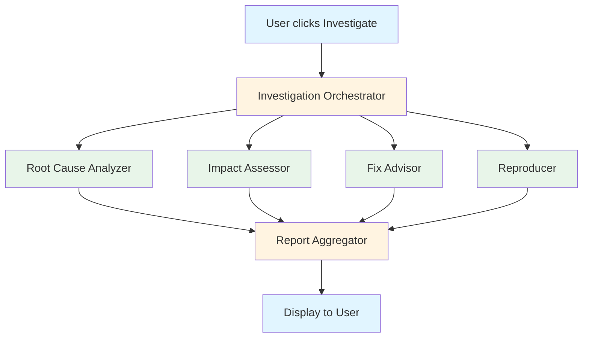

# GitHub Issues: Advanced AI Configuration

> Optimize AI investigations for performance, cost, and your specific needs

**Last updated:** 2026-02-16
**Audience:** Technical users, team leads | **Prerequisites:** [User Guide](github-issues-user-guide.md)

---

## Table of Contents

1. [Overview](#overview)
2. [Opus 4.6 Features](#opus-46-features)
3. [The 4 Specialist Agents](#the-4-specialist-agents)
4. [Pricing & Cost Management](#pricing--cost-management)
5. [Advanced Configuration](#advanced-configuration)
6. [Technical Architecture](#technical-architecture)

---

## Overview

This guide is for technical users who want to understand and optimize the AI-powered investigation system. You'll learn about Opus 4.6 features, specialist agent architecture, pricing, and advanced configuration options.

### Who This Guide Is For

- **Team leads** managing investigation budgets and performance
- **DevOps engineers** configuring Auto Claude for teams
- **Technical users** who want to understand what's happening under the hood
- **Cost-conscious users** optimizing token usage

### What You'll Learn

- How Fast Mode works and when to use it
- What each specialist agent does and how they're configured
- How to estimate and control investigation costs
- How to tune performance for your use case

---

## Opus 4.6 Features

Auto Claude's GitHub Issues investigation leverages Anthropic's Opus 4.6 model for advanced capabilities:

### 1. Fast Mode

**What It Is**
Fast Mode is an Opus 4.6 feature that generates output 2.5x faster than standard mode.

**How It Works**
- Uses optimized token generation from Opus 4.6
- Same intelligence, faster delivery
- Costs 6x more than standard mode ($150/M vs $25/M output tokens)
- Different pricing tier (see [Pricing](#pricing--cost-management))

**When to Use Fast Mode**
- ✅ Time-critical investigations
- ✅ Large codebases where standard mode takes too long
- ✅ Production incident response
- ❌ Non-urgent investigations (cost savings)

**Enable Fast Mode**
1. Go to **Project Settings → GitHub Integration → AI Investigation**
2. Toggle **"Enable Fast Mode"**
3. Investigations automatically use Fast Mode

> **Note:** Auto Claude automatically switches between accounts if you hit rate limits, regardless of mode.

### 2. 128K Output Tokens

**What It Is**
Opus 4.6 supports up to 128K output tokens—enough for extremely deep analysis.

**How It's Used**
The **Root Cause Analyzer** specialist gets the maximum token budget:
- Can trace issues across hundreds of files
- Provides detailed code explanations
- Returns comprehensive analysis with examples

**Why It Matters**
- Complex bugs require deep analysis
- Large codebases need more context
- Thorough investigations save debugging time

### 3. Per-Specialist Token Limits

Each specialist agent has a different token budget based on its role:

| Specialist | Token Limit | Rationale |
|------------|-------------|-----------|
| Root Cause Analyzer | 127,999 | Needs maximum depth for tracing |
| Impact Assessor | 63,999 | Analyzes scope, doesn't need code details |
| Fix Advisor | 63,999 | Provides approaches, not implementation |
| Reproducer | 63,999 | Analyzes test coverage, focused scope |

**Why Different Limits?**
- Root cause analysis is the most token-intensive (tracing code paths)
- Other specialists have focused tasks that need less output
- Optimizes cost while maintaining quality

### 4. Adaptive Thinking

**What It Is**
Adaptive thinking enables the model to spend more compute on complex problems.

**How It's Used**
- Difficult issues trigger high-effort thinking mode
- Straightforward issues use standard thinking
- Automatic - no configuration needed

**Benefit**
- Consistent quality across issue complexity
- No manual intervention needed
- Optimizes compute usage automatically

---

## The 4 Specialist Agents

Each investigation runs 4 specialist agents in parallel. Here's a deep dive into each:

### 🔍 Root Cause Analyzer

**Purpose**
Traces bugs and issues to their source code.

**How It Works**
1. Parses the issue description
2. Extracts and analyzes images from the issue (screenshots, error messages)
3. Searches codebase for relevant files
4. Analyzes code paths and dependencies
5. Identifies the exact source of the issue
6. Provides file paths and line numbers when possible

**Output**
- Root cause location (file:line)
- Explanation of why the issue occurs
- Code snippets showing the problem
- Related code that may need changes
- Image analysis (descriptions of screenshots, visual bugs, error messages in images)

**Token Budget:** 127,999 (maximum)

**Example Output**
```
Root Cause: apps/backend/services/auth.py:142

The issue occurs because the authentication middleware checks for
API keys before checking OAuth tokens. When a user authenticates
via OAuth, the middleware returns 401 Unauthorized before reaching
the OAuth validation logic.

The problematic code:
```python
if request.headers.get("X-API-Key"):
    validate_api_key(request)
elif request.headers.get("Authorization"):
    validate_oauth(request)  # Never reached
```
```

### 📊 Impact Assessor

**Purpose**
Determines the blast radius and user impact of issues.

**How It Works**
1. Analyzes which features use the affected code
2. Identifies user-facing impact
3. Checks for dependent systems
4. Estimates severity

**Output**
- Affected features and components
- User impact (who's affected, how many)
- Severity assessment (low/medium/high/critical)
- Related issues that may be impacted

**Token Budget:** 63,999

**Example Output**
```
Impact Assessment:

Affected Features:
- User login flow
- API authentication
- All protected endpoints

User Impact:
- All OAuth users cannot authenticate
- ~1,000 active users affected
- Critical severity (complete authentication failure)

Dependent Systems:
- Desktop app (relies on OAuth)
- Mobile app (relies on OAuth)
- Third-party integrations

Recommendation: Immediate fix required.
```

### 💡 Fix Advisor

**Purpose**
Suggests concrete fix approaches with pros and cons.

**How It Works**
1. Analyzes the root cause
2. Considers multiple solution approaches
3. Evaluates trade-offs
4. Recommends the best option

**Output**
- Multiple fix approaches (typically 2-3)
- Pros and cons for each approach
- Recommended approach with reasoning
- Implementation hints

**Token Budget:** 63,999

**Example Output**
```
Fix Approaches:

Option 1: Reorder middleware checks (RECOMMENDED)
Pros:
- Simple change (2 lines)
- No breaking changes
- Fixes all OAuth scenarios

Cons:
- Doesn't address API key edge cases

Option 2: Unified authentication handler
Pros:
- More maintainable long-term
- Handles edge cases

Cons:
- Larger change (100+ lines)
- Requires comprehensive testing
- Higher risk

Recommendation: Option 1 for immediate fix,
Option 2 for technical debt follow-up.
```

### 🧪 Reproducer

**Purpose**
Analyzes reproducibility and test coverage.

**How It Works**
1. Searches for existing tests
2. Analyzes reproduction steps from issue
3. Evaluates test coverage gaps
4. Suggests test improvements

**Output**
- Can the issue be reproduced?
- Do tests exist?
- Test coverage gaps
- Suggestions for test improvements

**Token Budget:** 63,999

**Example Output**
```
Reproducibility Analysis:

Reproducible: Yes
Steps:
1. Authenticate via OAuth
2. Make any API request
3. Receives 401 Unauthorized

Existing Tests: No tests for OAuth authentication flow

Test Coverage Gaps:
- No integration tests for OAuth
- No tests for middleware ordering
- No tests for mixed authentication scenarios

Recommendations:
- Add integration test for OAuth login
- Add test for mixed API key + OAuth scenarios
- Add regression test for this specific issue
```

---

## Pricing & Cost Management

### Investigation Costs

**Cost Factors**
- Token usage (input + output)
- Opus 4.6 model pricing
- Fast Mode multiplier (2.5x when enabled)

> **Note:** These are rough estimates—actual costs vary significantly by codebase size and issue complexity.

| Mode | Typical Range | Fast Mode Range |
|------|---------------|-----------------|
| Simple issue | $0.50 - $2.00 | $1.25 - $5.00 |
| Medium issue | $2.00 - $5.00 | $5.00 - $12.50 |
| Complex issue | $5.00 - $15.00 | $12.50 - $37.50 |

### Cost Optimization Strategies

**1. Use Standard Mode for Non-Urgent Issues**
- Reserve Fast Mode for time-critical investigations
- 60% cost savings on average

**2. Provide Clear Issue Descriptions**
- Well-described issues reduce back-and-forth
- Include reproduction steps
- Attach error logs

**3. Batch Similar Issues**
- Investigate related issues together
- Context caching reduces repeated analysis

**4. Review Investigation Results Before Creating Tasks**
- Not every issue needs a task
- Filter out duplicates or already-fixed issues

### Budget Monitoring

**Track Costs**
1. Go to **Settings → Claude Profiles**
2. Each profile shows usage statistics
3. View total tokens used and estimated costs

**Set Budget Alerts**
1. In Settings, set per-profile budget limits
2. Auto Claude alerts when approaching limits
3. Automatically switches to another account if available

---

## Advanced Configuration

> **Note:** Some advanced configuration options may require editing code directly. See [Customization Guide](github-issues-customization-guide.md) for programmatic configuration.

### Per-Specialist Configuration

Customize token limits per specialist (advanced):

1. Go to **Project Settings → GitHub Integration → AI Investigation → Advanced**
2. Expand specialist configuration
3. Adjust token limits per specialist:
   - Root Cause Analyzer (default: 127,999)
   - Impact Assessor (default: 63,999)
   - Fix Advisor (default: 63,999)
   - Reproducer (default: 63,999)

**When to Adjust**
- **Increase** if investigations are cut off mid-analysis
- **Decrease** to reduce costs for simpler investigations

> **Caution:** Lowering limits may reduce investigation quality.

### Performance Tuning

**For Speed**
- Enable Fast Mode (2.5x faster)
- Reduce token limits for non-critical specialists
- Use SSDs for faster context loading

**For Cost**
- Use Standard Mode
- Lower token limits for Impact, Fix Advisor, Reproducer
- Batch investigations to share context

**For Quality**
- Keep Root Cause Analyzer at maximum tokens
- Provide detailed issue descriptions
- Include reproduction steps and logs

### Multi-Account Management

Auto Claude supports multiple Claude accounts for:

- **Rate limit avoidance** - Automatic switching when limits hit
- **Cost distribution** - Spread usage across accounts
- **Redundancy** - Backup if one account fails

**Configure Multiple Accounts**
1. Go to **Settings → Claude Profiles**
2. Click **"Add Profile"**
3. Authenticate additional accounts
4. Auto Claude uses them automatically

**Account Selection Strategy**
Auto Claude automatically:
- Switches accounts when rate limited
- Balances usage across accounts
- Prioritizes accounts with available quota

---

## Technical Architecture

### Investigation Pipeline



### Backend Components

**Location:** `apps/backend/runners/github/`

| Component | File | Purpose |
|-----------|------|---------|
| Investigation Orchestrator | `services/investigation_hooks.py` | Manages investigation lifecycle |
| Specialist Runners | `services/investigation_spec_generator.py` | Runs each specialist |
| Report Aggregator | `services/investigation_models.py` | Combines specialist outputs |
| Context Builder | `context_gatherer.py` | Builds context for specialists |

### Frontend Components

**Location:** `apps/frontend/src/renderer/components/github-issues/`

| Component | File | Purpose |
|-----------|------|---------|
| Issue List | `GitHubIssuesList.tsx` | Displays fetched issues |
| Issue Detail | `GitHubIssueDetail.tsx` | Shows issue details |
| Investigation UI | `InvestigationProgress.tsx` | Shows specialist progress |
| Results Display | `InvestigationResults.tsx` | Displays investigation report |

### Data Flow

1. **User Action** → Frontend sends investigation request
2. **Orchestrator** → Creates context, spawns 4 specialists
3. **Specialists** → Run in parallel, each with full context
4. **Aggregator** → Combines outputs into unified report
5. **Frontend** → Displays real-time progress, then final report

### Context Injection

Each specialist receives:
- Issue details (title, description, comments)
- **Images** (URLs extracted from markdown and HTML img tags)
- Repository context (structure, main files)
- Code search results (relevant files)
- Related issues/PRs
- Specialist-specific configuration

**Image Support**
- Images are extracted from both markdown syntax (``) and HTML `` tags
- Root Cause Analyzer treats screenshots as **primary evidence**
- Up to 20 images are included in the investigation context
- Images from both issue body and comments are aggregated and deduplicated

> See [Customization Guide](github-issues-customization-guide.md#context-injection-system) for details on customizing context.

---

## Next Steps

**For most technical users:** You now have everything you need to optimize investigations.

**For developers:** See [Customization Guide](github-issues-customization-guide.md) to modify prompts, context injection, and extend the system.

---

**Need help?** Join the [Auto Claude community](https://github.com/AndyMik90/Auto-Claude/discussions) or report issues [on GitHub](https://github.com/AndyMik90/Auto-Claude/issues).
