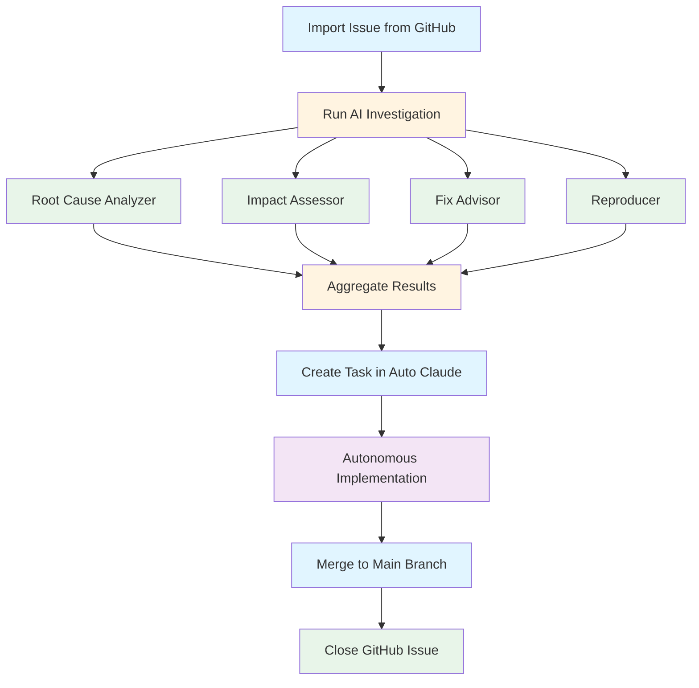

# GitHub Issues User Guide

> Your complete guide to using GitHub Issues integration in Auto Claude

**Last updated:** 2026-02-16
**Audience:** All users | **Prerequisites:** None

---

## Table of Contents

1. [Overview](#overview)
2. [Quick Start (5 Minutes)](#quick-start-5-minutes)
3. [Key Features](#key-features)
4. [Integration Workflow](#integration-workflow)
5. [Setup & Configuration](#setup--configuration)
6. [Using the Features](#using-the-features)
7. [FAQ](#faq)

---

## Overview

The GitHub Issues integration brings AI-powered investigation and autonomous development directly to your GitHub issues. Think of it as having a team of senior developers analyze your issues, find root causes, and prepare implementation plans—all automatically.

### What Can It Do?

- **Import issues** from any GitHub repository
- **Run AI investigations** with 4 parallel specialist agents
- **Create Auto Claude tasks** directly from investigation results
- **Post findings** back to GitHub as comments
- **Track progress** from issue to completed work

### Why Use It?

Traditional issue handling involves manual investigation, debugging, and planning. Auto Claude's GitHub Issues integration automates this:

- **Save time:** AI investigates while you focus on other work
- **Deeper insights:** 4 specialists analyze in parallel (root cause, impact, fixes, reproducibility)
- **Seamless workflow:** Go from GitHub issue to implemented feature without leaving Auto Claude
- **Consistent quality:** Every investigation follows the same thorough process

---

## Quick Start (5 Minutes)

Get your first issue investigated in under 5 minutes.

### Prerequisites

1. **Auto Claude installed** - Download from [GitHub Releases](https://github.com/AndyMik90/Auto-Claude/releases)
2. **GitHub account** - Any account with access to your target repository
3. **Claude credentials** - A Claude Code subscription (OAuth) or API key configured in Auto Claude settings

### Step 1: Connect Your Repository (1 minute)

1. Open Auto Claude and open your project
2. Go to **Project Settings → GitHub Integration**
3. Click **"Connect Repository"**
4. Enter your repository in `owner/repo` format (e.g., `AndyMik90/Auto-Claude`)
5. Choose your authentication method:
   - **OAuth** (recommended) - Sign in with your GitHub account
   - **GitHub CLI** - For advanced users with `gh` installed
6. Click **"Connect"** and authorize when prompted

> **Note:** The first time you connect, you'll need to authorize access. This is a one-time setup per project.

### Step 2: Import Issues (30 seconds)

1. Navigate to **GitHub Issues** in the sidebar
2. Click **"Fetch Issues"**
3. Select filter: Open, Closed, or All
4. Issues load automatically (50 per page)

### Step 3: Investigate an Issue (2 minutes)

1. Click on any issue to view details
2. Click the **"Investigate"** button
3. Watch as 4 AI specialist agents run in parallel:
   - 🔍 **Root Cause Analyzer** - Finds the source of the issue
   - 📊 **Impact Assessor** - Determines affected areas and users
   - 💡 **Fix Advisor** - Suggests solution approaches
   - 🧪 **Reproducer** - Analyzes reproducibility and test coverage

### Step 4: Create a Task (30 seconds)

Once investigation completes:

1. Review the investigation report
2. Click **"Create Task"**
3. Auto Claude creates a new task with all investigation context
4. The task is ready for the autonomous build pipeline

**That's it!** You've gone from GitHub issue to ready-to-build task in 5 minutes.

> **Next:** Learn about [all features](#key-features) or [configure settings](#setup--configuration)

---

## Key Features

### Issue Management

**Import & Browse**
- Fetch issues from any GitHub repository
- Filter by status: Open, Closed, or All
- Pagination for large repositories (50 issues per page)
- Real-time updates from GitHub

**Issue Details**
- Full issue view with title, description, and comments
- Labels, assignees, and milestones
- Issue metadata (created date, last updated, author)
- Linked pull requests and commits

### AI-Powered Investigation

**4 Parallel Specialist Agents**
Each issue investigation runs 4 specialist agents simultaneously:

| Specialist | What It Does | Why It Matters |
|------------|--------------|----------------|
| 🔍 **Root Cause Analyzer** | Traces bugs/issues to their source code | Know exactly what to fix |
| 📊 **Impact Assessor** | Determines affected areas and user impact | Understand the blast radius |
| 💡 **Fix Advisor** | Suggests concrete solution approaches | Compare options before coding |
| 🧪 **Reproducer** | Analyzes reproducibility and test coverage | Know if you have test coverage |

**Investigation Report**
The completed report includes:
- **Root cause location** - Exact files and line numbers when possible
- **Impact analysis** - Which features/users are affected
- **Fix approaches** - Multiple options with pros/cons
- **Reproducibility** - Can the issue be reproduced? Do tests exist?
- **Confidence levels** - How certain is each finding?

### Task Creation

**From Investigation to Task**
One click converts investigation results into an Auto Claude task:
- All investigation context included automatically
- Ready for the autonomous build pipeline
- Maintains link to original GitHub issue
- Tracked through completion

**Task Context Includes**
- Investigation findings
- Relevant code files
- Related issues/PRs
- Repository context

### GitHub Integration

**Post Findings**
Share investigation results directly to GitHub:
- Post investigation report as a comment
- Update issue labels
- Close issues after resolution

**Activity Tracking**
Every issue tracks:
- Investigation history
- Task creation events
- Resolution status
- Comments posted back to GitHub

---

## Integration Workflow

The GitHub Issues integration follows a simple pipeline from issue to completed work:



### Stage Details

**1. Import Issue**
- Fetch from GitHub repository
- View with all context (comments, labels, metadata)
- Select based on priority, labels, or assignment

**2. Investigate with AI**
- 4 specialists analyze in parallel
- Root cause, impact, fix options, reproducibility
- Comprehensive report in minutes

**3. Create Task**
- One-click task creation
- All investigation context included
- Ready for autonomous build pipeline

**4. Implement**
- Auto Claude agents plan and implement
- Code review and QA validation
- All within isolated git worktree

**5. Merge & Close**
- Semantic merge back to main branch
- Update GitHub issue
- Close issue when complete

> This workflow keeps your main branch safe while autonomous agents work in isolated environments.

---

## Setup & Configuration

### GitHub Authentication

Auto Claude uses GitHub CLI for secure authentication:

**Step 1: Install GitHub CLI**
```bash
# macOS
brew install gh

# Windows
winget install --id GitHub.cli

# Linux
# See https://github.com/cli/cli#installation
```

**Step 2: Authenticate**
```bash
gh auth login
```

Follow the prompts:
1. Choose **GitHub.com**
2. Choose **HTTPS**
3. Choose **Login with a web browser**

**Step 3: Verify**
```bash
gh auth status
```

You should see your GitHub account information.

### Connect a Repository

1. Open Auto Claude
2. Create or open a project
3. Go to **Project Settings → GitHub Integration**
4. Click **"Connect Repository"**
5. Enter repository in `owner/repo` format: `AndyMik90/Auto-Claude`
6. Click **"Connect"**

Auto Claude verifies access and loads repository metadata.

### Investigation Settings

Go to **Project Settings → GitHub Integration → AI Investigation**:

**Fast Mode (Optional)**
- Toggle **"Enable Fast Mode"** for 2.5x faster investigations
- Uses premium Opus 4.6 pricing
- Best for: Time-critical investigations, large codebases

**Model Selection**
- **Standard Mode:** Balanced speed and cost
- **Fast Mode:** Faster investigations, different pricing
- Auto Claude switches automatically if you hit rate limits

> **Note:** See [Advanced AI Configuration](github-issues-advanced-ai-configuration.md) for details on pricing and performance tuning.

---

## Using the Features

### Importing & Browsing Issues

**Fetch Issues**
1. Navigate to **GitHub Issues** in the sidebar
2. Click **"Fetch Issues"**
3. Select filter: Open, Closed, or All
4. Issues load with pagination (50 per page)

**Filter & Search**
- Use the filter dropdown to switch between Open/Closed/All
- Scroll to load more pages automatically
- Click any issue to view details

**Issue Detail View**
- Title and description
- All comments (chronological)
- Labels, assignees, milestones
- Metadata (created, updated, author)
- Linked pull requests and commits

### Running AI Investigations

**Start an Investigation**
1. Open any issue from the list
2. Review the issue details
3. Click the **"Investigate"** button

**Investigation Progress**
Watch as 4 specialist agents run in parallel:
- Each specialist shows progress in real-time
- Terminal output shows agent thinking
- Estimated time remaining updates continuously

**Investigation Results**
When complete, the report shows:
- **Root Cause** - What's causing the issue, where it is
- **Impact** - What's affected, who's impacted
- **Fix Options** - Multiple approaches with pros/cons
- **Reproducibility** - Can it be reproduced? Test coverage
- **Confidence** - How certain is each finding?

> **Tip:** Results vary by issue type. Bugs get detailed root causes; feature requests get architectural analysis.

### Creating Tasks from Results

**Create a Task**
1. Review the investigation report
2. Click **"Create Task"**
3. Confirm task details (auto-populated from investigation)
4. Task appears in your Auto Claude task list

**What's Included**
- Investigation findings
- Relevant code files and context
- Link to original GitHub issue
- Implementation suggestions from the Fix Advisor

**Next Steps**
The task is now ready for Auto Claude's autonomous pipeline:
- Planner agent breaks it into subtasks
- Coder agents implement the solution
- QA agents validate the work
- You review and merge

### Posting Findings to GitHub

**Share Results**
1. After investigation completes, click **"Post to GitHub"**
2. Choose what to include:
   - Full investigation report
   - Summary only
   - Custom message
3. Click **"Post"** to add as a comment

**Update Issue Status**
- Add labels based on investigation findings
- Close issue if resolved
- Link related tasks

**Activity Tracking**
All GitHub interactions are tracked:
- Comments posted
- Labels added
- Issues closed
- Timestamps for each action

---

## FAQ

### General

**Q: Do I need a GitHub account?**
A: Yes, you need a GitHub account with access to the repositories you want to investigate.

**Q: Does this work with private repositories?**
A: Yes, as long as your GitHub account has access to the private repository.

**Q: Can I investigate issues from any repository?**
A: Yes, any repository you have access to—your own repos, organization repos, or public repos.

### Investigation

**Q: How long does an investigation take?**
A: Typically 2-5 minutes for standard mode, 1-2 minutes with Fast Mode enabled. Complex issues may take longer.

**Q: What if the investigation doesn't find a root cause?**
A: The specialists report their confidence levels. Low confidence means more context is needed—try again after providing more information or reproduction steps.

**Q: Can I run multiple investigations at once?**
A: Yes, you can investigate multiple issues simultaneously. Each investigation runs independently with its own specialists.

**Q: Do investigations use my API quota?**
A: GitHub API calls are minimal (fetching issues). The heavy lifting is done by Auto Claude's AI agents, which use your Claude API subscription or configured profiles.

### Tasks & Implementation

**Q: Do I have to create a task after investigating?**
A: No, you can investigate just to understand the issue. Task creation is optional.

**Q: Can I edit the task before starting the build?**
A: Yes, the task is fully editable. You can modify the description, add requirements, or adjust the scope.

**Q: What happens to the task after implementation?**
A: The task goes through QA validation, then you review the changes before merging to your main branch.

### Troubleshooting

**Q: "Failed to fetch issues" error**
A: Check that:
- GitHub CLI is authenticated (`gh auth status`)
- Your repository URL is correct
- You have access to the repository

**Q: Investigation stuck at "Starting..."**
A: This usually means:
- Claude API is unreachable (check your connection)
- Rate limit hit (Auto Claude switches accounts automatically)
- Check Settings → Claude Profiles for account status

**Q: Results seem inaccurate**
A: Investigation quality depends on:
- Issue description quality (be specific!)
- Codebase accessibility
- Reproduction steps (if known)
Try providing more context and re-investigate.

---

## Next Steps

**For most users:** You're ready to go! Start investigating issues.

**For technical users:** See [Advanced AI Configuration](github-issues-advanced-ai-configuration.md) to optimize performance and costs.

**For developers:** See [Customization Guide](github-issues-customization-guide.md) to extend and customize the integration.

---

**Need help?** Join the [Auto Claude community](https://github.com/AndyMik90/Auto-Claude/discussions) or report issues [on GitHub](https://github.com/AndyMik90/Auto-Claude/issues).
